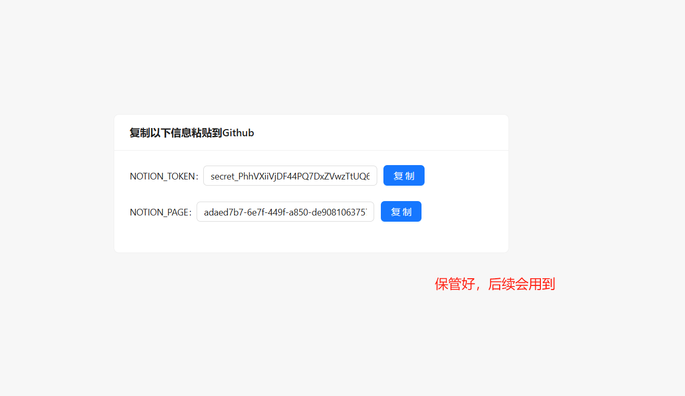

# 可以做什么

使用此工具可快速补充 notion 电影海报、影评、分类标签、演员列表等信息。

# 实现原理

根据 notion 中用户输入的基础信息（影片名称、影片类型、上映年份）调用搜索接口，将搜索到的结果填充到notion中。
 
 
基础信息有： 

- title：影片名称（必填） 
- category：影片类型（必选）（剧集or电影） 
- year：上映年份（选填） 

 
影片不排除含有重名的情况，只根据影片名称与类型搜索并不能保证搜索结果的准确性，因此用户填充上映年份信息，可以提高准确率。

# 如何使用

前提条件：

- 注册 Github 账号
- 注册 Notion
- 注册 Tmdb 账号，并申请 API Key

使用步骤：

1. 登录 Github 账号，fork 此项目： [notion-movie-faster](https://github.com/youzhajun/notion-movie-faster)

    

2. 点击以下链接 [notion-connect](https://api.notion.com/v1/oauth/authorize?client_id=01db2a25-2fc0-4b06-a396-88798313d0b3&response_type=code&owner=user&redirect_uri=https%3A%2F%2Fnotion-token.youzhajun.top)，添加 notion 集成，获取 notion token 与 模板 id

    

    

    

3. 检查个人 notion 中是否新增了影视模板，并确证该模板中是否连接了 notion-movies-faster 集成

    

4. 个人 github notion-movies-faster 仓库中，添加密钥，配置 NOTION_TOKEN(第三步获取值)、NOTION_DATABASE_ID(第三步获取值)、TMDB_KEY(前提条件已申请)

    

# 常见问题

- notion 数据是否会泄露？ 
程序会读取 notion 中的数据但并不会存储或向第三方发送。项目代码开源，实现原理实现步骤一看便知。

- github action 执行失败了怎么办？ 
进入 github 仓库，点击 Actions 按钮，找到运行失败的记录，点击查看详情，根据日志输出排查错误（大概率是token或其他密钥填写错误，或 maven 构建时网络错误）

- 是否可以修改触发同步程序的方式？ 
目前程序提供了两种方式触发同步机制
1. 定时任务。每隔一段时间去扫描 notion 数据库中的数据进行同步（默认，无需修改配置）
2. 借助第三方工具 zapier 实现 notion 自动化。原理：notion 数据改变后会触发 zapier 的自动化任务，该任务会去修改个人仓库中的 issues，issues 的变动会触发 github actions 从而执行程序。

# 后期计划

- [ ] 修改 Notion database 更加美观
- [ ] 开发前端页面展示

# 依赖项目

我们之所以望得更远，只因我们站在巨人的肩膀上。

[notion-sdk-jvm-core](https://github.com/seratch/notion-sdk-jvm)

[hutool](https://doc.hutool.cn/pages/index/)

# 捐赠
如果此项目对你有所帮助，请您点击 start 对作者表示鼓励，感谢！

